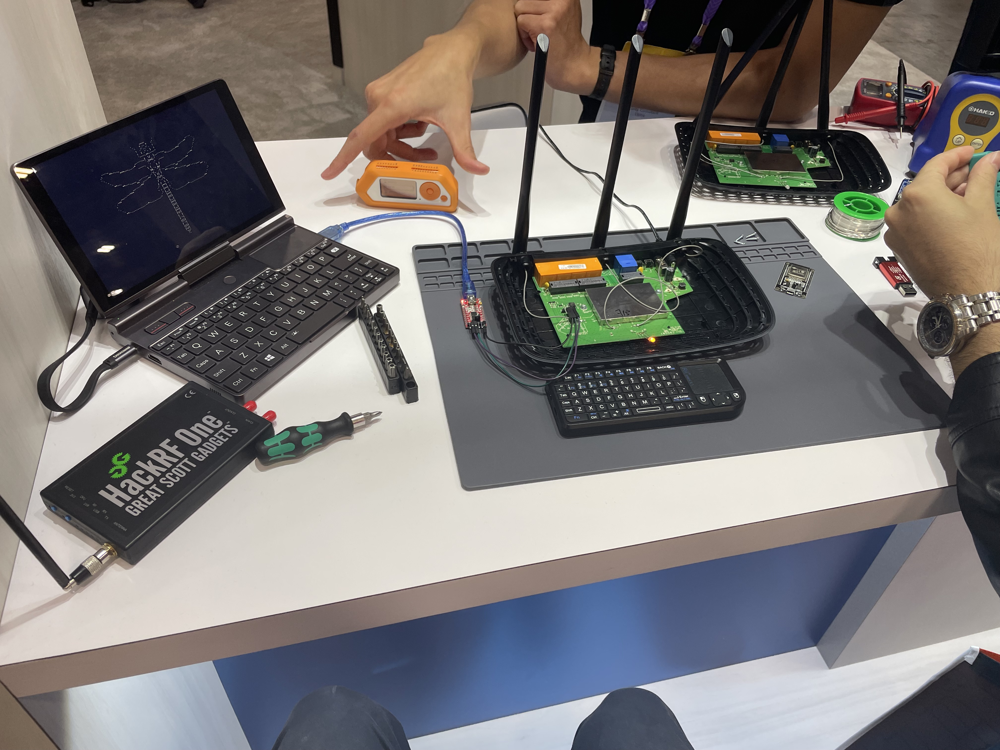
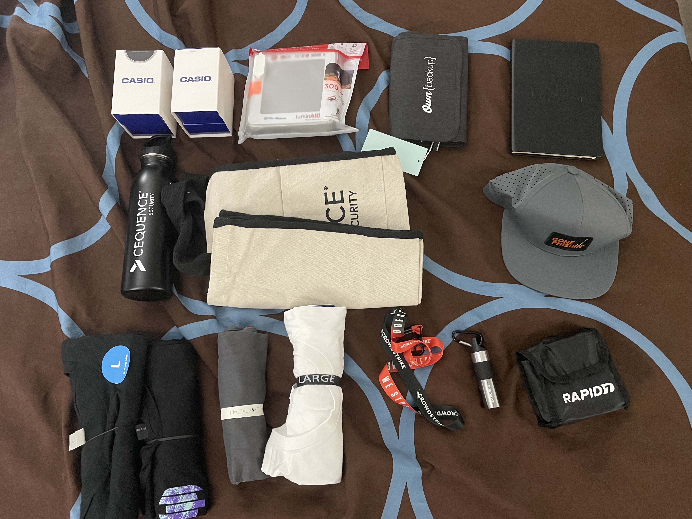
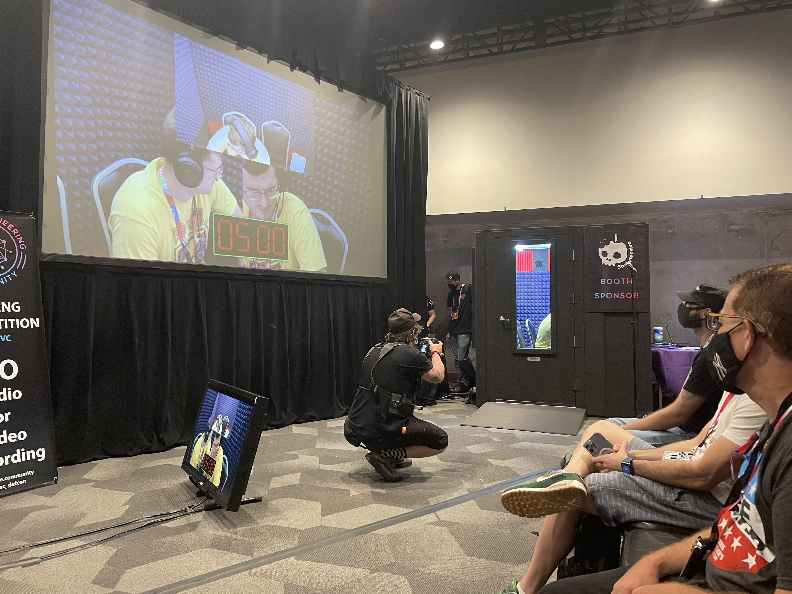
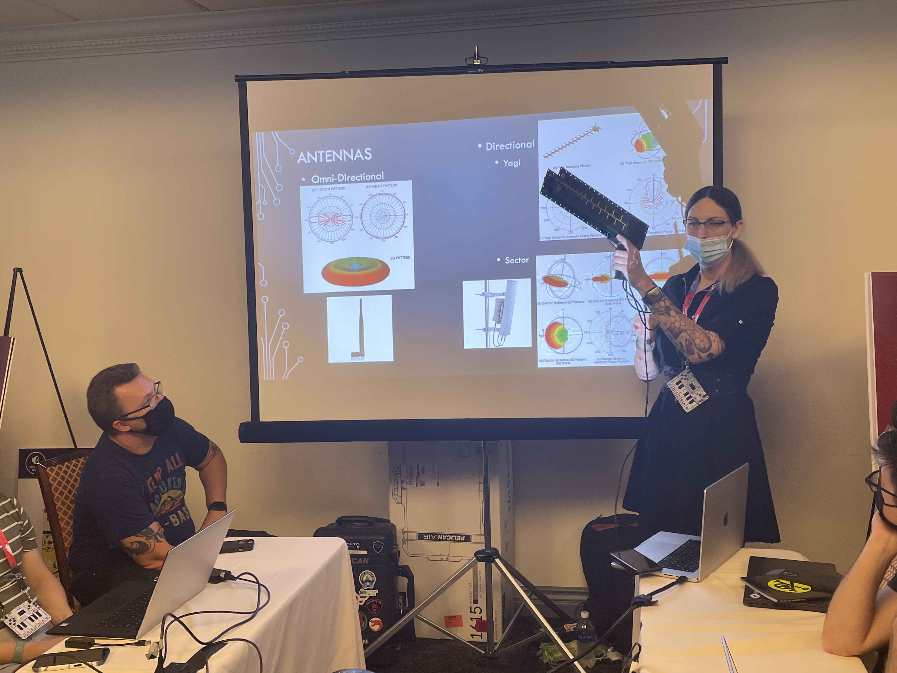
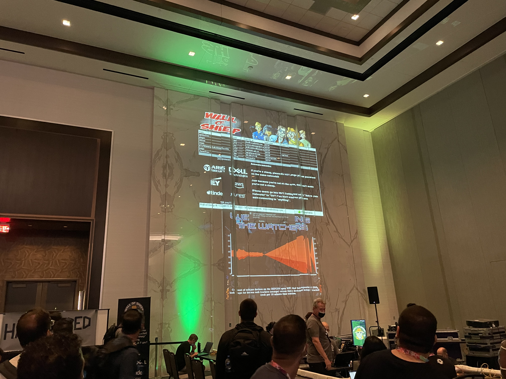
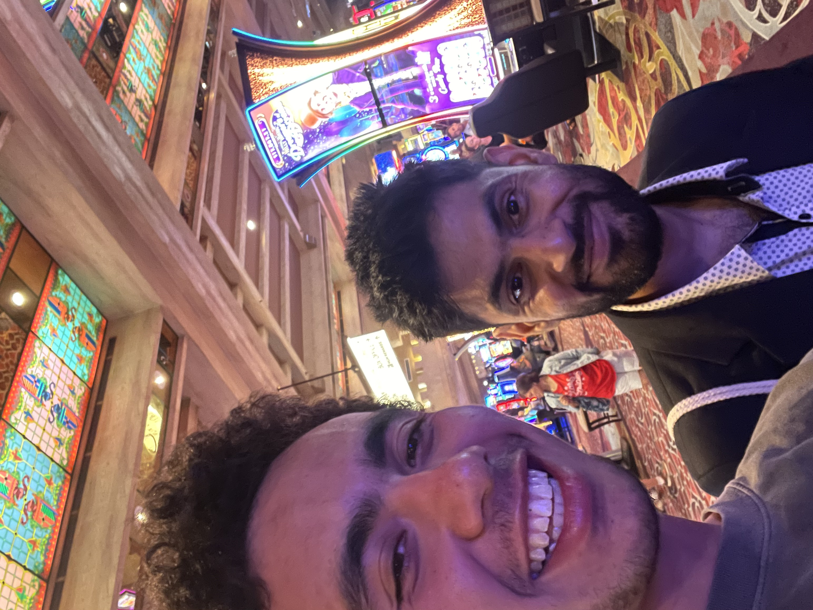

This is a quick writeup of when I got to go to DEFCON and Blackhat in August 2022.

## Intro

As I was really starting to become more interested in cybersecurity, earlier in 2022 I started to look at some of the figures of this field. Richard Buckland, the head of the Cybersecurity department at UNSW, got me started in this field. At UNSW, one of my teachers for Web Application Security was @abhijeth, who coincidentally was speaking at Blackhat 2022 while I was going to be in America. Talking with him more and seeing my interest, he helped me get a ticket to go (since they were $300). Abijeth suggested I tweet out that I was a student interested in Cyber and I wanted to go to DEFCON, so I created a twitter account and tweeted something out, he retweeted it and @prashant3535 had a few volunteer passes left (thanks Prashant!) and he gave me a pass. Abijeth also helped me get a flight from San Fransisco to Las Vegas for the conference (Abhijeth is a legend).

## Prelude

I had some time before and after the conference to wander around. This was my first time in Las Vegas so there was a lot to see. I got the best tacos of my life, tried In and Out for the first time and wandered the casinos. I was also practicing my Physical Pentesting and Social Engineering skills so I broke into the Wynn hotel's swimming pool for a quick swim.
{:style="width: 60%; display:block; margin-left:auto; margin-right:auto"}

The next day I also snuck into the Blackhat conference which runs a few days before DEFCON but is mainly for business people and is much more corporate compared to DEFCON. This means the tickets are much more expensive (around $2000 for an individual) and all the booths were run by sales people who didn't really know much about the product/technology. Luckily however, there were some cool gadgets and heaps of free swag which I gladly took.

{:style="width: 60%; display:block; margin-left:auto; margin-right:auto "}
{:style="width: 60%; display:block; margin-left:auto; margin-right:auto "}

## DEFCON

During my time at DEFCON it was the first time I truly immersed myself in the world of cyber. The event was filled with incredibly intelligent and driven individuals who were giving insightful talks, running hands-on workshops, and showcasing their hacking skills. Words of caution were given to me before I went which included DO NOT bring your laptop with you to the conference, turn off wifi and bluetooth on your phone and keep everything close to you (there is a large intersection between hackers and pickpockets).

### There were so many interesting people and interesting talks/workshops but here is a brief summary of what I did:

- Helped set up the DEFCON Recon Village with @prashant3535 which had a CTF about OSINT and doing reconaissance
- Went to a Skylight talk. This is where there are intentionally no recordings of the event since the content is too dangerous/prohibitive. I waited like 1.5 hours for this and it ended up being the lamest talk I've been to...
- Live Vishing where contestants try and get as much information through social engineering and voice phishing customer service technicians/assistants etc. We all watch as they succesfully get information about the CEO and office security etc.
  {:style="width: 60%; display:block; margin-left:auto; margin-right:auto "}
- Did a physical hacking workshop to get root on a router (eMMC to root). This involves interacting with eMMC, making binary copies of flash, altering startup files to allow for root over SSH on a router.
- Went to a workshop where medical companies had medical devices that they wanted people to try and hack
- Went to a password cracking workshop, going in depth of how passwords are cracked.
  From what I learnt, the best way to crack a password hash is to look at the top topology (pattern matching).
  Most passwords follow common structures where we identify passwords by ?u (uppercase) ?l (lowercase) ?d (digit) ?s (special characters). The two most common topologies are:
  - ?u?l?l?l?l?l?d?d?s (e.g Nachos22!)
  - ?u?l?l?l?l?l?l?l?d?d?d?d (e.g Benjamin1990)
- Learnt about the radio protocol used by planes, rockets and machines in the agriculture sector are vulnerable or even unencrypted
- Went to a wireless hacking workshop where we learnt common attacks and the vulnerabilities in Wifi , Bluetooth, BLE, LORA, Zigbee, RFID etc from @FreqyXin
  {:style="width: 60%; display:block; margin-left:auto; margin-right:auto "}
- Saw a conference showing the winners of Wigle DC30. This is a competition done by people around the world to try and get information on the most wifi networks (wardriving), very similar to my previous project <a href="https://josephf123.github.io/posts/seasame-fox/">Seasame fox</a>. Super interesting, each person had a different tactic, different hardware to use, specs about the bandwidth, the frequency of the receiver etc. All data is then sent to <a href="https://wigle.net">https://wigle.net</a>
- Saw some car hacking. Using the CAN bus you can control the car.
- Wall of sheep listens to network traffic and tries to find logins that are through HTTP (which is unencrypted) and puts the name of those people on the wall as a message of caution
  {:style="width: 60%; display:block; margin-left:auto; margin-right:auto "}
- Went to a phone privacy talk. So much data is sucked up by Google/Apple and there are so many incentives to. Alternative operating systems like CalyxOS and GrapheneOS are better. <a href="https://github.com/matthewnash/building-phone-privacy/wiki">https://github.com/matthewnash/building-phone-privacy/wiki</a>
- I went to a free rooftop pool party that was hosted DEFCON

## Conclusion

Very interesting time. Met some cool people, went to some cool talks. Thanks @abijeth for helping me get there!
{:style="width: 30%; display:block; margin-left:auto; margin-right:auto"}
