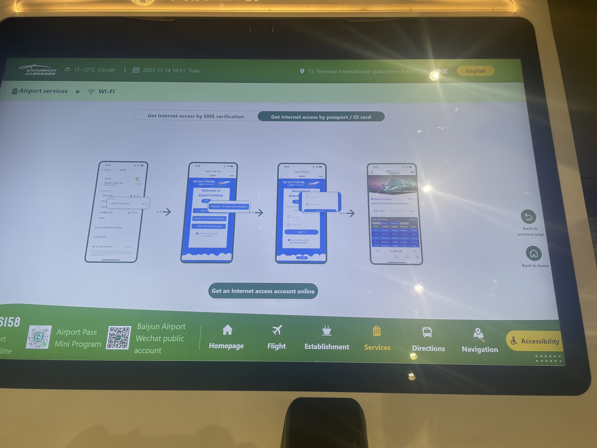
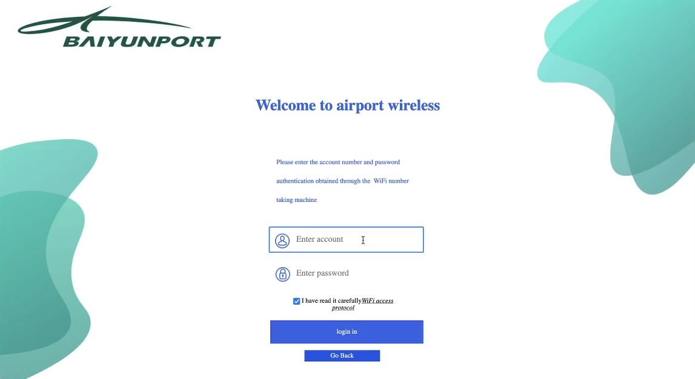
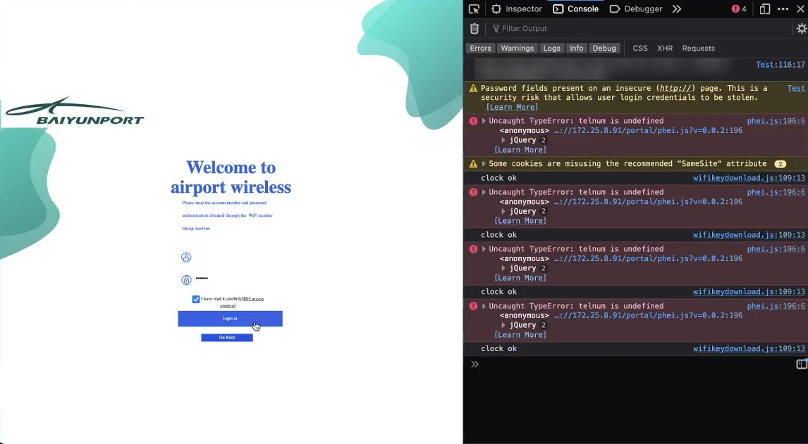
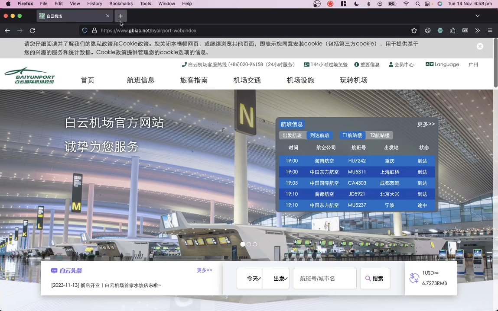

## Intro

Recently I went to China, and on my way back home I stopped off in Guangzhou for a 3 hour layover. While I was there my goal was to get some work done and so I tried to connect to the airport wifi.

Hmm it seems that to connect to the wifi, you have to register your passport to get a wifi login code. Ahh of course, just china trying to give you a personalised experience!





After sacrificing my last shred of privacy while in China, I succumbed and scanned my passport to get my login details. However, when trying to connect to the wifi from my laptop, nothing seemed to work.

After many failed attempts of spamming the 'login button', I thought about what all the great hackers do. Inspect element.



Logging into the wifi, you either needed a chinese phone number or to scan your passport. Since I didn't have a chinese phone number I was using the other way of logging in and so I found it strange when I got this error message.

## Fixing their code

Looking at the source code I understood a lot better what was happening. Whenever I press the login button, first some client side code is run which does some input checks, crafts a POST request and sends it to the server. The problem is, bad code is being run that just fails and so no request is sent to the server. If I rewrite some of the code and inject it into the website, I can get my own code to run (that doesn't break) and so a request can be sent to the server. This is called Console Injection.

Code in a file called phei.js runs once the login button is pressed, instead of running
`$('.btn-userlogin').click()` the code runs `$('.btn-login').click()`. This small error actually completely changes how the code runs. `btn-login` in this case refers to logging in via telephone number whereas `btn-userlogin` refers to logging in via a username. This causes some of the frontend code to break, causing no HTTP request to be sent.

The error that we see occurs specifically because a function is called which tries to dynamically retrieve an HTML element that doesn't exist, causing `telnum is undefined`.

```
getTelnum: function(){
	return $('input.input-phone').val()
}
```

If we instead rewrite this `getTelnum()` function to return something that is not null, we won't get any error messages.

```
getTelnum: function(){
        return "12345678910"
}
```

Once we do this, there is another bit of client side code that is failing, `code is undefined`. It is the exact same problem, adding my own `getCode()` function solves this.

Now the client side logic successfully passes and so a request can be sent out to the server. When we submit however, it alerts us 验证码错误 which translates to "Verification code error"

Of course this happens. The client side logic detects that the phone number is "12345678910" and code is "1234" and sends that request out. We need to reverse engineer how the request is supposed to be sent out when we are logging in via the other method.

> note: I tried briefly to craft my own HTTP request instead of having to go through the browser and fix the client side code, however I realised there were a lot of information in the headers that was needed including unknown variables which realistically would be much easier to get when the browser crafts the request.

## Changing the POST request

Looking at the code, we see two main differences in the POST request that is crafted depending on if we are logging in via "telephone" or via "account". First it is in the HTTP header. The endpoint we are going to via telephone is

`/api/aruba_a_c/smslogin/gwId/Test`

instead of

`/api/aruba_a_c/userlogin/gwId/Test`

Next, if we look at the body of the request, using "telephone" we get the format

`telnum=12345678910&code=1234`

and from looking at the source code, for "account" we have to use the format

`username=AB12345&password=123456`.

So now using a tool like BurpSuite, we can capture the request that is sent out and change these two parameters so it goes from

```
POST /api/aruba_a_c/smslogin/gwId/Test HTTP/1.1
Host: 172.25.8.91

telnum=12345678910&code=1234
```

into

```
POST /api/aruba_a_c/userlogin/gwId/Test HTTP/1.1
Host: 172.25.8.91

username=AB12345&password=123456
```

Once we do this, and we forward our payload, after a few redirects, it works! I can now have access to the vastness of the internet.



## Conclusion

Now at the end of the day, I didn't really do any real hacking. To be honest I did the opposite, I fixed the airport's broken wifi portal. The problem with their website was, the logic used to log someone in via telephone number was being used for people that were trying to log in with their account number. This meant that things were breaking client side and no HTTP request was sent. These were fixed in three steps:

##### Step 1. use Console Injection to get the client side code to send the HTTP request

##### Step 2. use BurpSuite and understanding the code to rewrite the HTTP request

##### Step 3. 💸 💸 💸
