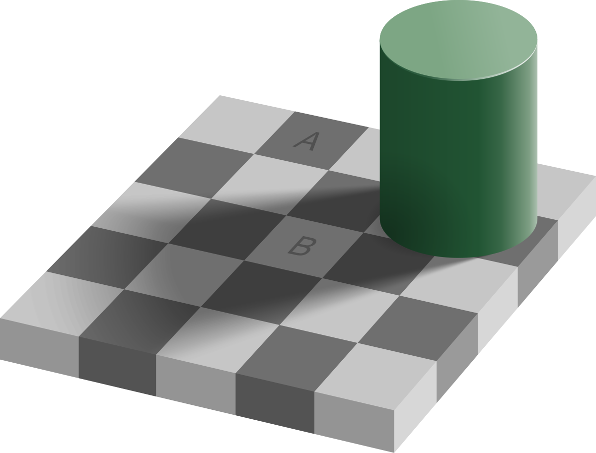
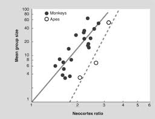

In this article, I will explore how prediction and simulation serve as common threads between artificial and biological intelligence. We'll journey through the layers of predictive mechanisms in the human brain, starting with basic sensory processing and moving to increasingly complex capabilities like motor control, reward processing, and social cognition. By understanding these parallels between human cognition and artificial intelligence, we can better grasp not only how LLMs work, but also gain deeper insights into the nature of intelligence itself. This exploration reveals that while humans and LLMs may seem vastly different, they share a fundamental reliance on prediction and simulation to create and maintain accurate models of the world around them.

## Background

Recently I participated in a private bug bounty with Anthropic, one of the leading AI research companies. I was tasked with finding vulnerabilities and ways to convince an LLM (Large Language Model) to tell me things it was not supposed to (jailbreaking). From the program I won $AUD2400 and I was immersed into the world of LLMs, how they work, their weaknesses and especially, how did intelligence emerge from these models. In my first article I discussed how abstract concepts emerge from training on large amounts of data. In this article, I want to explore some similarities and differences from biological systems like the brain.

## The brain

The brain is a lot more complex than the transformer architecture in LLMs. It has evolved for over millions of years and has gone through major changes and adjustments, from simple worm-like creatures which have a few hundred neurons, to humans with over a billion. The mechanics of how the brain developed was not a one-shot to human intelligence. It slapped on increasingly complex capabilities into the brain, developing and regressing, older parts being reused for new capabilities, and slowly arrived at human intelligence. It is not the story of optimising for a single function (like LLMs are) but instead a hotpotch slapping together of newer mechanisms that work together well. Although the mechanisms of evolution were different, both humans and LLMs arrive at the conclusion of having impressive prediction capabilities.
Let’s explore the evolutionary biology of the human brain and the increasingly complex predictions and simulation that are used to see, move around and make decisions in the world.

## Prediction in the senses

One of the first predictive capabilities that emerged in organisms was from sensory input, with most of the processing coming from vision. Our brain processes the data that comes from our eyes through the visual cortex, from this there are layers of neurons that process this input and do computations that allow us to detect objects and perceive motion. Our visual cortex surprisingly gets a lot of input from the prefrontal cortex (PFC) passing top down predictions of what we see, imbuing our past experiences and knowledge into these predictions.[[1]](https://www.pnas.org/doi/10.1073/pnas.1523834113)[[2]](https://en.wikipedia.org/wiki/Predictive_coding) This prediction that is fed by the PFC is important since we don’t have the time or bandwidth to process every single object all the time, especially in survival like when being attacked. When we move our head, our brain is actually predicting what the world would look like given our head movement, rotating our reality synchronously with our head movement. Not only does the PFC account for head movement, it predicts what is hidden and predicts common environments. If someone is holding a cup, your brain predicts that behind their hand is the rest of the cup, predicting its color, shape and texture. When what is under the cup differs from the prediction, the ACC (Anterior cingulate cortex) sends a signal saying that the prediction is different from the actual reality. Similarly, if the regular coffee shop you visit has suddenly changed furniture, your ACC will fire since the brain's predicted outcome and the actual outcome differ. The ACC is the main component that is responsible for regulating prediction, the signal is then processed by the PFC and your world model changes, which is why the next time you go to the coffee shop, you won’t be surprised.

Optical illusions work precisely because they exploit our brain's prediction machinery of actively predicting the world around us. Our brain fills the gap and actively predicts based on past experiences, imprinting predictions in our visions.[[3]](https://en.wikipedia.org/wiki/Optical_illusion#Cognitive_processes_hypothesis) In the classic checkerboard shadow illusion, our brain predicts and adjusts for shadow effects so strongly that two squares of identical color appear dramatically different. The illusion persists even when we know the truth - showing how deeply ingrained these predictive mechanisms are.

(in this image, tiles A and B are the same color)

Our visual system isn’t the only system that has a strong predictive component, our body movements also are heavily influenced by our ability to predict and simulate.

## Simulation in movement

The motor cortex has a strong simulating and predicting component illustrated by [mirror neurons](https://en.wikipedia.org/wiki/Mirror_neuron). These neurons fire in the brain when watching someone else perform any physical movement. Just by watching, the brain is able to simulate which muscles need to contract, which to rotate and which to extend. These mirror neurons are found in humans, primates and even mice and developed in order for us to perform more sophisticated actions. By combining prediction from the senses, the newer sensory-motor prediction now is able to model and simulate movements of not just ourselves, but the people around us, in order to better navigate and better make decisions. Prediction and simulation of our movements and others around us lead to an improved world model of how others will behave which is important for group coordination; not only this, but being able to simulate and predict how others move is extremely useful for learning complex movements like hunting or tool use. Similar to the visual system, our motor prediction and simulation requires error prediction and correction. The cerebellum is the primary component which helps compare predicted outcome vs actual outcome, helping you correct your model when the outcome differs. This discovery that simulating movement fires these mirror neurons has had interesting applications - sport psychologists recommend players visualise playing the night before the game in order to strengthen these connections and simulate these movements, citing better performance in the game[[4]](https://www.peaksports.com/sports-psychology-blog/sports-visualization-athletes/). Our prediction and simulation goes even further than just the eyes and body, abstract concepts like decision making and motivation also has strong ties to prediction and simulation.

## Simulation in rewards

The brain’s dopamine reward system motivates us to hunt, eat and move. Not only this - it also plays a crucial part in managing how we view rewards as well as how we reconcile these with the prediction of rewards. Our understanding of this prediction system emerged through several key discoveries. In the 1930s, researchers first observed rats exhibiting [vicarious trial and error](https://www.nature.com/articles/nrn.2015.30) behavior - moving their heads side to side at maze decision points, appearing to evaluate their options. However, the neural mechanisms weren't understood until Wolfram Schultz's groundbreaking work in the 1980s and 1990s. His research revealed that the ventral tegmental area (VTA) releases dopamine not simply in response to rewards, but based on how outcomes compare to predictions - more dopamine for better-than-expected outcomes, less for worse-than-expected results. This discovery proved that a mammal's dopamine reward system included a component specifically designed for prediction, not just reward processing[[5]](https://gruber.yale.edu/recipient/wolfram-schultz). Later research in the 1990s and 2000s revealed another crucial component: the hippocampus's ability to actively simulate future events, essentially "playing" them in the brain.[[6]](https://en.wikipedia.org/wiki/Hippocampal_replay) This capability, common across mammals, allows us to simulate possible future scenarios and outcomes, with the VTA serving as a mechanism to evaluate and refine these predictions against reality.

## Social prediction and simulation

The accumulation and build up of these predictive models and systems allowed for primates and humans to participate in an exponentially harder form of simulation and prediction: social situations. By combining all previous prediction mechanisms: sensory information, physical movement and simulating actions and their rewards, primates and humans were now able to predict higher order models: the brains of the people around them. This concept called “Theory of Mind” is essential for the thriving of primates in social settings. This isn't just about recognizing that others have different thoughts - it's about running complex simulations of other minds to predict behavior. When an ape encounters a rival near a food source, their brain is actively simulating possible scenarios: "If I display aggression, will they back down? If I share the food, will they become an ally?" These predictions become increasingly sophisticated as social groups grow larger and more complex.

The increase in complexity which was required to simulate larger social groups was theorised to cause the growing brain size of primates. The [Social Brain Hypothesis](https://pubmed.ncbi.nlm.nih.gov/19575315/) theorises that navigating these social hierarchies was the primary driver in the increase in brain size which justifies the argument that simulation and prediction plays a large role of the brain’s function, especially in the neocortex. This hypothesis is backed by the correlation between monkey brain sizes and the size of the social circle. The larger the social circle, the larger the size of the neocortex.

As our brains evolved, our simulation of the world became of even higher fidelity. We were able to model complex interactions, combining our changing environment, the changing minds of the people around us and our own dynamic behaviors. The hippocampus (which was used by rats in vicarious trial and error) combined with the [default mode network](https://en.wikipedia.org/wiki/Default_mode_network#Function) of the brain allowed us to project ourselves into the future. This complex system went further than just picking which way to go in a maze but also helped us plan how we would spend our winters, simulating the right things to say in social contexts and much more complex, long term planning. Here, the fidelity and accuracy of our world model becomes even more important, as we begin to make decisions that account for months or even years into the future.

## Prediction vs Simulation

The relationship between prediction and simulation is more nuanced than it might first appear. While we often think of prediction as forecasting a single outcome and simulation as exploring multiple scenarios, the boundary between them is surprisingly fluid. When we predict multiple "what if" scenarios - like an ape considering different approaches to a food-sharing situation, or an LLM exploring various possible outcomes of a social interaction - we're effectively performing simulation through multiple predictions.

So while simulation and prediction share the underlying need for an internal world model, simulation is a more active process that involves engaging in multiple different possibilities, hypotheticals and counterfactuals. Simulation can be shallowly emulated through prompting techniques asking the LLM to think of many different possibilities and post training techniques rewarding more thinking and simulating.

## Conclusion

From the increasingly complex predictive capabilities that complement and add on top of each other - humans have developed into very intelligent creatures. From sensory prediction, to motor simulation, to reward based processing, to social cognition and self narrativization, humans have developed immensely complex prediction and simulation mechanisms that allow us to model and learn from the world around us, with each predictive system also including an error signal to compare and update our predictions with.

Similar to biological organisms, artificial neural networks like LLMs are trained to become better at one thing: prediction. By training this model to predict the next word, it must create an accurate world model, this world model must be able to simulate scenarios accurately and consistently. If you can predict the next word well, you can predict how prey will move, you can simulate how someone would act given their beliefs and values, you can predict how complex social scenarios will evolve, you can predict a coherent and consistent reason why someone did a certain action - just like humans do (even to themselves).

Understanding this shared foundation of prediction helps us better grasp what intelligence actually is. Rather than being a mystical quality unique to biological systems, intelligence emerges from the ability to build accurate models of the world and use them to simulate.

## Sources

I'm quite new to the world of neuroscience and biology, this was mainly sparked by my interest in this field and reading a few books

- [A Thousand Brains: A New Theory of Intelligence](https://www.amazon.com.au/Thousand-Brains-New-Theory-Intelligence/dp/1541675819)
- [A Brief History of Intelligence: Evolution, Ai, and the Five Breakthroughs That Made Our Brains](https://www.amazon.com.au/Brief-History-Intelligence-Humans-Breakthroughs/dp/0063286343)
- [Behave: The Biology of Humans at Our Best and Worst](https://www.amazon.com.au/Behave-Biology-Humans-Best-Worst/dp/1594205078)
