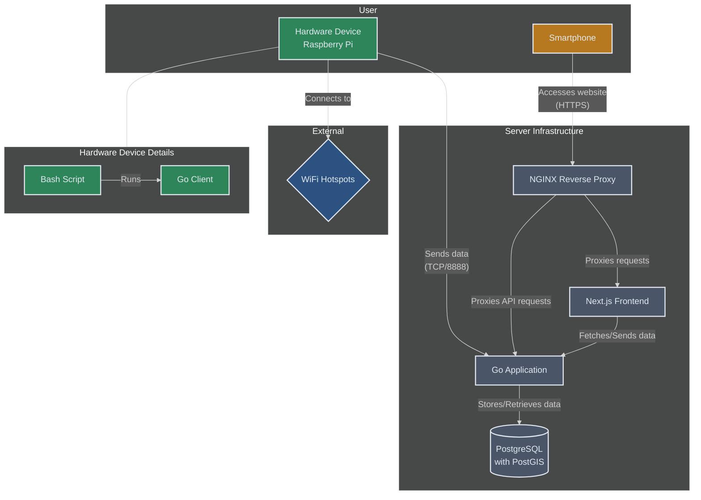
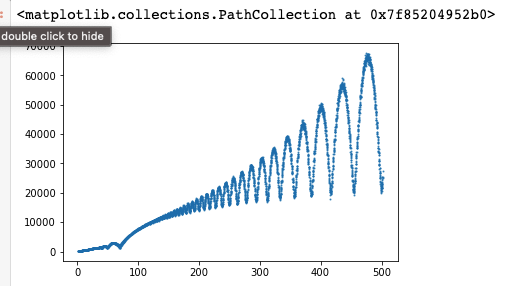

I like to build things. Here's some of them:

### Faast-go

Adopting the philosophy of Infrastructure as Code, an open source simple enumeration tool for recon and payload sending through YAML rather than the command line. Using worker pools for parallel computing and written in Golang. [Github repo](https://github.com/defectivemaker/faast-go)

### [Guided AI](https://guidedcoach.ai/)

Initially born from a hackathon project me and my friend worked on. We ended up winning some prize money and so thought to continue the idea. Closely integrates biometric data while doing physical activities such as running, pushups or meditation to give personalised feedback as if you had a personal coach with you. It uses text-to-speech technology (initially using Elevenlabs but now fine tuned our own model) to give realistic and motivational voices such as David Goggins so it sounds like he's with you while you are training. Watch our video submission here.


### [Touch grass](/posts/touch-grass)

This is the project I've been working on the longest. Deals with all layers of the stack and technology. Hardware configuring the Raspberry pi, setting up scripts and services to run on the Pi, implementing the Go client that runs on the Pi, ansible scripting for setup, custom protocol on top of TCP/TLS, backend server with authentication + routing + communication for HTTP and custom protocol, frontend with NextJS, real time notifications with websockets and pg_notify, infrastructure set up and configured with Docker and docker compose.
More details in blog post

### [Seasame fox 🦊](/posts/seasame-fox)

A potential way for mass surveillance on a budget. Unfortunately iPhone and android have MAC address randomisation and rotation so no longer possible :( Sorry NSA

### Arduino controlled LED lights

Integrated with my room for controlled and programmable LED lights. Reverse engineered my TV remote's HEX codes to be able to control the LEDs via the remote. [Github repo](https://github.com/defectivemaker/led-lights)

### Homemade breathalyser

Fun to bring to parties to see how drunk you are, using Arduino and 3d printed chassis and custom LED screen. [Github repo](https://github.com/defectivemaker/breathalyser)

### [Simulating gambling tactics](/posts/simulating-gambling-tactics)

Written in python and then optimised in C++ for performance. Used to test my hypothesis about the Martingale strategy in Roulette and the mathematics behind it.
More details in blog post

### [Bookmark Manager](https://chromewebstore.google.com/detail/bookmark-manager/agkebpnjkaemkbejjlinpbieghchlfda)

This was my first big project when I was around 17. I had no idea what I was doing. Everything
was plain javascript and css (and jquery). It was for my personal use case and then I shared it as
an extension on the chrome web store. It has 250+ daily active users, 2.5k total installs, 270k total impressions. [Github repo](https://github.com/josephf123/BM-MK-2)


